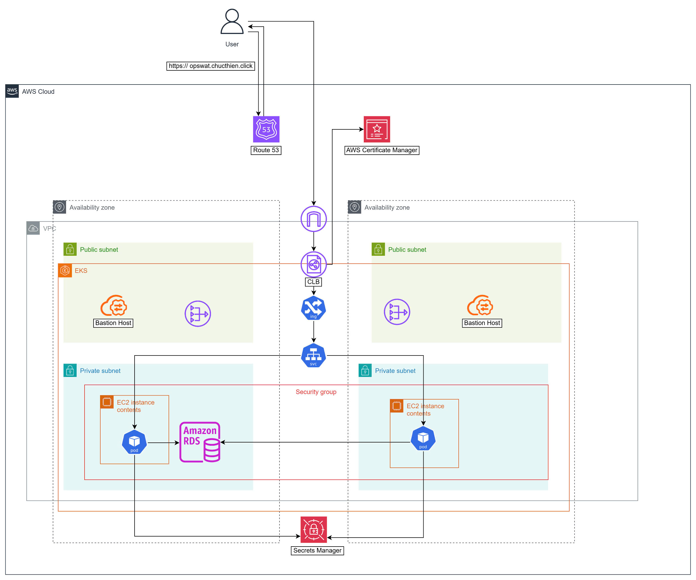

# ☕️ Go CoffeeShop Deployment Organization

## 🏢 Organization Purpose

This GitHub organization was created to support the final DevOps assignment for my internship. The goal is to provision, deploy, and operate a microservices-based web application called **Go CoffeeShop** 🚀 in both **development** and **production** environments using DevOps practices.

---
## Table of Contents

- [1. Summary](#️-1-summary)
    - [1.1. Infrastructure as Code (IaC)](#11️-infrastructure-as-code-iac-)
    - [1.2. Application Deployment](#12--application-deployment)
    - [1.3. CI/CD (Continuous Integration/Continuous Delivery)](#13--cicd-continuous-integrationcontinuous-delivery)
    - [1.4. Monitoring](#14--monitoring)
- [2. Application Homepage](#2-application-homepage)
- [3. Architecture Diagrams](#3-architecture-diagrams)
    - [3.1. Kubernetes Application Architecture Diagram](#31-kubernetes-application-architecture-diagram)
    - [3.2. AWS Infrastructure Architecture Diagram](#32-aws-infrastructure-architecture-diagram)
    - [3.3. CI/CD and Monitoring Workflow Diagram](#33-cicd-and-monitoring-workflow-diagram)
- [4. Repositories Overview](#4--repositories-overview)
    - [4.1. coffeeshop-manifests](#41-coffeeshop-manifests)
    - [4.2. coffeeshop-infrastructure](#42-coffeeshop-infrastructure)
- [Reference Source Code](#-reference-source-code)
- [Contact](#-contact)

## ⚙️ **1. Summary**

###  **1.1.🏗️ Infrastructure as Code (IaC) **

* Leveraging **Terraform** to provision core infrastructure resources, including:
    * EC2 Instances
    * EKS Cluster
    * VPC (Virtual Private Cloud)
    * Security Groups
    * S3 Bucket

### **1.2. 🚀 Application Deployment**

* **Dev (Development Environment):**
    * Deployed on a single **EC2 instance** is provisioned using Terraform and is configured by pipeline SSH script.
    * **Docker** and **Docker Compose** are installed on the EC2 instance.
    * Application services are defined in the `docker-compose.yml` file.
    * Health checks are configured for PostgreSQL and RabbitMQ.
* **Prod (Production Environment):**
    * A  **EKS cluster** is provisioned using Terraform, consisting of **2 t3.large EC2 worker nodes**.
    * Application components are deployed via **Kubernetes YAML manifests**.
    * **HPA** (Horizontal Pod Autoscaler) is configured for all the application Deployment such as `proxy`,`web-frontend`, `product`, `counter`, `rabbitmq`, `barista` and `kitchen`
    * Integration with **Route 53** for DNS management and  **AWS Certificates Manager** for automated **HTTPS** certificate provisioning.
* **💾 Database:**
    * Utilizing **Amazon RDS** with **PostgreSQL** (free-tier).
    * Database credentials are securely stored in **AWS Secrets Manager**.
    * The RDS instance resides within a **private subnet** with Security Group rules restricting network access. Allow source is from security group EKS and public subnet (for bastion host)

### **1.3 🔄 CI/CD (Continuous Integration/Continuous Delivery)**

* **GitHub Actions** is employed to build CI/CD pipelines, which includes:
    * Automated provisioning and teardown of the development environment.
    * Automated **container image scanning** using **Trivy** with email notifications.
    * Pushing the validated container image to a private **ECR** (Elastic Container Registry).
    * Automatically updating the image tag in `docker-compose.yml` and Kubernetes YAML manifests.
    * Notifications upon pipeline completion.
* **CD for production environment** is implemented via **Argo CD** following a **GitOps pull-based model**.

### **1.4. 📊 Monitoring**

* The system is monitored using **Datadog**.
* Key performance metrics are collected, including:
    * CPU Utilization
    * Memory Utilization
    * HTTP Request Statistics on API Server (4xx Client Errors / 5xx Server Errors)
    * HPA Status
* 🚨 Alert if:
    * HPA current replicas `>=` HPA max replicas
    * CPU Usage exceeds 80% threshold
    * 5xx Server Errors are occurring

---

##  **2. Application Homepage**

### **Application overview**:
The CoffeeShop application appears to be a web application designed to manage ordering and payments within a coffee shop, allows users to:
- View and select products available on the coffee shop's menu (likely seen on the [Home screen](#homescreen-image)).
- Make payments for their orders easily and conveniently (as shown on the [Payment screen](#paymentscreen-image)).
- Track their order history (displayed on the [Order list screen](#orderlistscreen-image)).
#### **Home screen**

#### **Payment screen**

#### **Orderlist screen**

---

## **3. Architecture Diagrams**

Here are descriptions of the architecture diagrams for the CoffeeShop application:

### 3.1. Kubernetes Application Architecture Diagram

This diagram illustrates the Kubernetes-based architecture of the CoffeeShop application. It depicts the flow of traffic from a user accessing the application through  `https://opswat.chucthien.click` which resolves to a Traefik ingress controller within a Kubernetes cluster.

The diagram shows the following key components:

* **Traefik:** Acting as an ingress controller, routing external traffic to the appropriate services within the cluster. It handles `opswat.chucthien.click/` and `opswat.chucthien.click/proxy`.
* **Web Frontend:** A pod running the web frontend of the application, exposed on port 8888. It scales up/down based on CPU utilization.
* **Proxy:** Another pod acting as a proxy, potentially for internal communication or handling specific requests, exposed on port 5000. It also scales up/down based on CPU utilization.
* **Product Service:** A set of pods running the product catalog service, communicating on port 5001.
* **Counter Service:** A set of pods running a counter service, communicating on port 5002.
* **RabbitMQ:** A RabbitMQ message broker, accessed via `rabbitmq:5672`.
* **Barista Service**: A set of pods representing the barista application logic.
* **Kitchen Service**: A set of pods representing the kitchen application logic.
* **External Secrets Operator:** This component interacts with AWS Secrets Manager to retrieve sensitive information (External Secret) needed by the application.

The diagram highlights the internal communication between different microservices within the Kubernetes cluster and how external requests are routed to the frontend  and proxy. It also shows the dependency on external services like Traefik, RabbitMQ, AWS Elastic LoadBalancer and AWS Secrets Manager.

### 3.2. AWS Infrastructure Architecture Diagram

This diagram outlines the AWS infrastructure supporting the CoffeeShop application. It shows a multi-Availability Zone (AZ) setup within an AWS Virtual Private Cloud (VPC).

Key components depicted include:

* **User:** Accessing the application via `https://opswat.chucthien.click`.
* **Route 53:** AWS's scalable DNS service, routing traffic to a Classic Load Balancer (CLB).
* **AWS Certificate Manager:** Used to provision and manage SSL/TLS certificates for secure communication.
* **Classic Load Balancer (CLB):** When Traefik is apply, it will create a Kubernetes Load Balancer and it will be assiged a AWS Elastic Load Balancer.
* **Availability Zones:** The architecture spans across two Availability Zones for increased resilience.
* **Public Subnets:** Contain resources that need to be accessible from the internet, such as the CLB and potentially Bastion Hosts (for check service in private subnets).
* **Private Subnets:** Contain more sensitive resources that should not be directly exposed to the internet, such as the Amazon RDS database and EC2 instances running the application's containers (within an EKS cluster).
* **Amazon Elastic Kubernetes Service (EKS):** A managed Kubernetes service in AWS, likely hosting the application's containers.
* **EC2 Instances (Containers):** EC2 instances running the application's containerized workloads.
* **Bastion Hosts:** Securely provisioned EC2 instances used to access resources in the private subnets.
* **Amazon Relational Database Service (PosgreSQL):** A managed relational database service.
* **Security Group:** Controls the inbound and outbound traffic for the EC2 instances, RDS and Load Balancer.
* **Secret Manager:** Store RDS Postgres credentials will be used by Pod in the cluster.

This diagram emphasizes the high availability and security aspects of the AWS infrastructure, utilizing load balancing, multiple availability zones, and private subnets to protect the application and its data.

### 3.3. CI/CD and Monitoring Workflow Diagram

This diagram illustrates the Continuous Integration/Continuous Deployment (CI/CD) pipeline and the monitoring workflow for the CoffeeShop application.

The CI/CD pipeline starts with code changes being pushed to **GitHub**. This triggers a **Trigger Pipeline** managed by **GitHub Actions**. The pipeline includes steps like:

* **CI Pipeline:**
    * **Trigger**: when a TAG pushed with the pattern **v*** ex: v1.01, v2.9
    * **Trivy Scan Image:** Scanning Docker images for vulnerabilities.
    * **Login AWS:** Authenticating with AWS.
    * **Push Image with new tag to ECR:** Pushing the newly built and scanned Docker image to Amazon Elastic Container Registry (ECR).
    * **Update manifest and create PR:** Updating Kubernetes manifests with the new image tag and creating a Pull Request (PR) for review.
    * **Email/Notification:** Sending notifications about the CI process.
* **CD Pipeline (Dev Environment):**
    * **Provision Dev Environment:** Setting up or updating the development environment.
    * **Setup Dev Environment:** Configuring the development environment.
    * **Install Docker, Install Docker Compose, AWS Login:** Ensuring necessary tools are installed.
    * **Docker Compose Up:** Deploying the application in the development environment using Docker Compose.
    * **Email/Notification:** Sending notifications about the CD process in the development environment.
* **CD Pipeline (Prod Environment):**
    * * **ArgoCD:** a GitOps continuous delivery tool, pulling changes and syncing the application state in the **EKS - Prod Environment**.

The monitoring workflow involves:

* **Datadog Agent:** Running within the EKS production environment to collect metrics.
* **Push Metric:** Sending collected metrics to **Datadog** for monitoring and analysis.
* **Alert:** Datadog triggers alerts based on defined thresholds.
* **Email Notification:** Sending alerts via email.

This diagram highlights the automated processes for building, testing, deploying, and monitoring the CoffeeShop application, emphasizing security scanning, GitOps principles, and centralized monitoring with Datadog.

---

## 4. 📂 Repositories Overview

### 4.1. [`coffeeshop-manifests`](https://github.com/Chuc-Thien-DevOps-Final-Project/go-coffeshop)

**Purpose:** Stores all deployment configurations.

-   **Production:** ☸️ Kubernetes YAML files (EKS)
-   **Development:** 🐳 Docker Compose files (EC2)
-   **CI/CD:** ⚙️ GitHub Actions
    -   Image scanning (🔍 Trivy)
    -   Image push (📤 Docker private registry)
    -   Auto-deployment (🚀 ArgoCD - Production, 🐳 Docker Compose - Development)

**Technologies:** Kubernetes · Docker Compose · GitHub Actions · ArgoCD · Trivy · Traefik · External Secret Operator ·  Locust

---

### 4.2. [`coffeeshop-infrastructure`](https://github.com/Chuc-Thien-DevOps-Final-Project/infrastructure)

**Purpose:** Contains Infrastructure-as-Code (IaC) using Terraform.

-   **Development:** EC2 instances with VPC and Security group
-   **Production:** EKS cluster with VPC
-   **State Management:** Remote S3 Backend with versioning and enable lock state.

**Technologies:** Terraform · AWS (EC2, EKS, VPC, Security groups)

---

## 📚 Reference Source Code

Source Code (microservices): [https://github.com/thangchung/go-coffeeshop](https://github.com/thangchung/go-coffeeshop)

## 📬 Contact

For any questions or assistance, please feel free to reach out through the following channels:

* **LinkedIn:** [TranChucThien](https://www.linkedin.com/in/tranchucthien/)
* **Email:** chucthien2@gmail.com